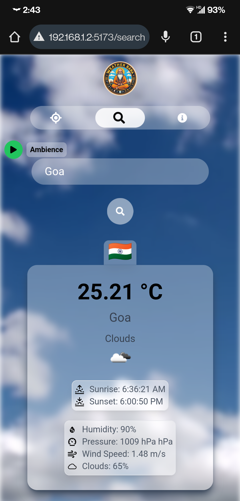
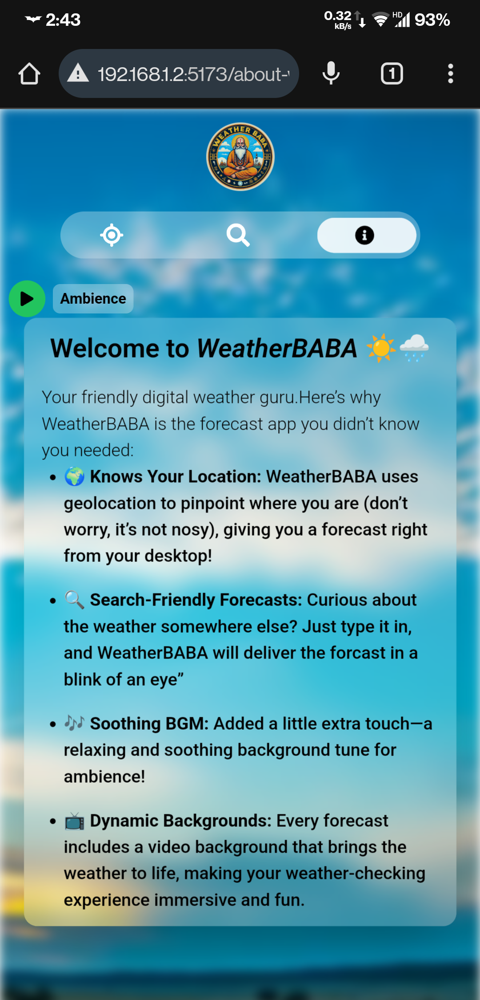

  
  WeatherBABA

**Weather BABA** is a real-time weather application that dynamically updates its visuals based on current weather conditions, offering a smooth and interactive experience. Built with ReactJS and Tailwind CSS.

---

## 🚀 Live Demo

[Check out Weather BABA on Vercel!](#) _(coming soon)_

---

## 📸 Screenshots

  <!-- Desktop Screenshots -->
  
  
  
  
  
  <!-- Mobile Screenshots with adjusted width for uniformity -->
  

    
    
  

## 🛠️ Features

- **Dynamic Weather Visuals**: Background changes based on the current weather.
- **Responsive Design**: Looks great on both mobile and desktop devices.
- **Real-time Weather Data**: Shows accurate weather details for any location.
- **Ambient Music**: Plays a relaxing music track in the background.
- **Optimized User Experience**: Updates weather info only when the form is submitted, minimizing re-renders.

---

## 💡 What I Learned

- **ReactJS & Component Structure**: Organized reusable components (e.g., `Header`, `Footer`, `WeatherInfo`) for a clean architecture.
- **React Context API & Custom Hooks**: Leveraged Context API (`context`) and custom hooks (`useWeatherInfo`) to manage and share state seamlessly.
- **API Integration**: Retrieved weather data using the OpenWeather API, handling responses effectively.
- **Responsive & Dynamic Styling**: Tailored CSS for mobile and desktop views, with real-time UI adjustments based on weather.
- **Project Structuring**: Organized code into well-defined sections (`components`, `assets`, `hooks`, etc.), enhancing maintainability.

---

## 🧗 Major Challenges

- **Data Consistency**: Keeping the weather data the same across all parts of the app without repeating the data fetching.

  - **Solution**: Used React Context API and custom hooks to manage the data in one place.

- **Preventing Slowdowns**: Stopping the app from slowing down due to unnecessary updates when the weather or form inputs change.

  - **Solution**: Only updated the weather data when the form was submitted.

- **Dynamic Background Animations**: Creating smooth background changes for different weather conditions without slowing down the app.

  - **Solution**: Used conditional logic to change the background based on the weather.

- **Efficient User Input Handling**: Avoiding updates every time the user types or changes the form.
  - **Solution**: Only updated when the form was submitted, making the app run smoother.

---

## 🛠️ Technologies Used

- **Frontend**: ReactJS, Tailwind CSS
- **API**: OpenWeather API
- **State Management**: React Context API, Custom Hooks
- **Routing**: React Router
- **Deployment**: Vercel

---

## 📧 Contact

Created by **Arshit Kumar**

- [LinkedIn](https://www.linkedin.com/in/arshitkk/#)
- [GitHub](https://www.github.com/arshitkk/#)
- [Twitter / X](https://www.x.com/arshitkk/#)
- [Instagram](https://www.instagram.com/arshitkk/#)
- [Email](mailto:arshitkumar222@gmail.com)
